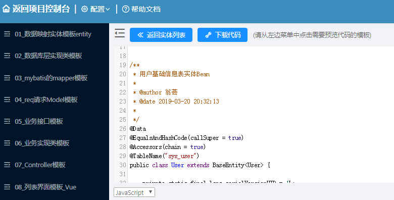

## 项目说明
* 项目整合了SpringBoot、Mybatis、Mybatis-lus、Swagger-ui、Druid、lombok、validator等常用
  框架提供后端开发脚手架。
* 基于该脚本手架，提供`在线` `生成代码`功能。【通过SQL一建生成增删改查代码】 
   *  代码在线生成访问地址：http://www.handbyhand.club/coder  用户名/密码：api-starter/api-starter
   *  代码生成使用帮助文档：http://www.handbyhand.club/knowtree/guest/coder
   *  代码下复制到脚手架中,直接可以使用，如下：
   
 
       
 ## 项目开发环境启动
 
 * 修改本地maven配置文件settings.xml中增加包依赖配置
 ```xml
    <mirror>
			<id>framework-repo</id>
			<mirrorOf>framework-repo</mirrorOf>
			<name>framework-repo</name>
			   <url>https://raw.githubusercontent.com/wengsongwei8/maven-repo/master</url>  
		</mirror>
```
 如果有配置```xml<mirrorOf>*</mirrorOf>```，由改为：<mirrorOf>*,!framework-repo</mirrorOf>

    因为<mirrorOf>*</mirrorOf>会覆盖掉所有的repository,导致项目中的repository不生效,所以需要以上配置
 * 还原数据库【数据库备份脚本在deploy/db目录】
 * 在配置文件：application-dev.yml中修改数据库配置
 * 直接启动com.weng.framework.SampleApiStarterApplication类即可。
 * 访问swagger-ui地址：http://127.0.0.1:8000/swagger-ui.html
 * 访问druid地址： http://127.0.0.1:8000/druid   admin/admin

   

## 项目打包部署
* 打包命令：mvn clean assembly:assembly -Pdev 其中dev指的是开发环境 
* 执行完打包命令以后，将生成一个.zip部署包
* 目录结构如下
    * bin启动和停止脚本
    * logs日志路径
    * conf 配置文件的位置
    * lib 依赖的jar
* 把zip部署上传到linux服务器，然后到bin目录下执行./start.sh即可


## 常见问题
* 没安装lombok插件，导致部分代码显示报错（不影响正常运行）。

    * lombok插件可以在我们简化很多代码，安插也非常方便
    * idea中安装：打开IDEA的Setting –> 选择Plugins选项 –> 选择Browse repositories –> 搜索lombok –> 点击安装 –> 安装完成重启IDEA –> 安装成功
    * eclipse安装，先到官网下载lombok.jar，官网地址：https://projectlombok.org/download，
        将lombok.jar包拷贝到eclipse的安装目录下，并且在eclipse.ini文件中添加如下两行
    
    -Xbootclasspath/a:lombok.jar    --备注：如果没有这一行也是没问题的 <br/>
    -javaagent:lombok.jar
